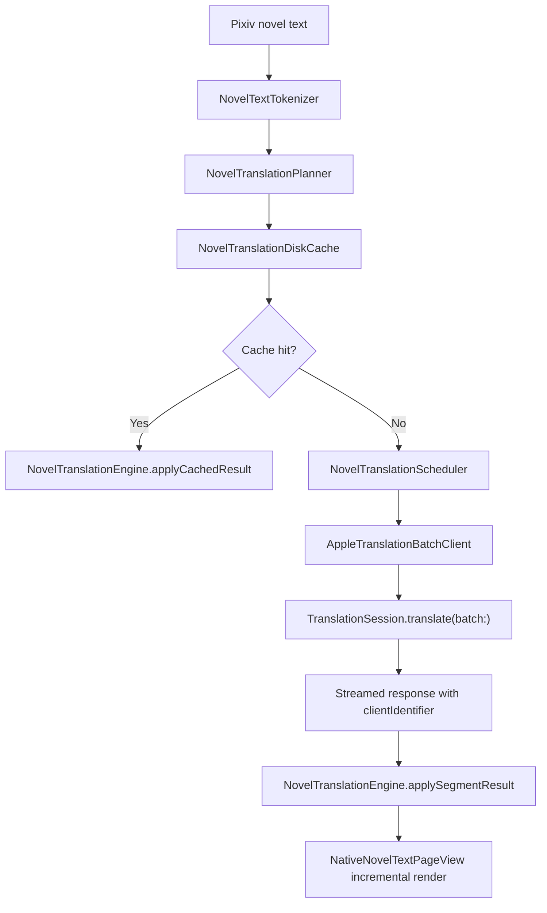

# Novel Translation Plan

This document tracks the plan for improving KeiPix novel translation. It is
written as an execution checklist so a future goal can pick up the work without
redoing the research.

## Goal

Make novel translation feel fast, native, private, and low-maintenance by using
Apple's system Translation framework as the default engine across macOS, iOS,
and iPadOS.

The desired reader experience is:

- Bilingual mode shows original text immediately and fills translated paragraphs
  as they return.
- Immersive mode replaces completed segments while preserving readable fallback
  text for segments still in progress.
- Visible pages or visible continuous-reader ranges translate before distant
  prefetch work.
- Completed translations are cached across page navigation and app launches.
- Users do not need API keys, provider accounts, extra model runtimes, or
  third-party translation setup for the default path.

## Non-Goals

- Do not introduce `SwiftStreamingMarkdown` for the novel reader. Pixiv novels
  are plain text plus Pixiv-specific inline tags, not Markdown.
- Do not build a Pot/Bob-style global translator inside KeiPix. KeiPix only needs
  in-app translation for its own captions and novel reader.
- Do not add third-party/cloud translation providers in the first implementation
  pass. Provider abstraction can be revisited after the Apple system path is
  fast, cached, and reliable.
- Do not move long novel text rendering back into pure SwiftUI. Keep the hot
  text path owned by the existing native text renderer.

## Current KeiPix Baseline

| Area | Current state | File |
| --- | --- | --- |
| Novel reader API entry | Uses `.translationTask` with `TranslationSession.Configuration`. | `Sources/KeiPix/Views/NovelReaderView.swift` |
| Novel translation work | Collects text tokens for one page, launches per-paragraph `session.translate(_:)` tasks, then applies results after the page batch completes. | `Sources/KeiPix/Views/NovelReaderView.swift` |
| Translation state | Main-actor observable engine with per-page, per-token in-memory cache. | `Sources/KeiPix/Support/NovelTranslationEngine.swift` |
| Caption translation | Uses the same Apple Translation framework for inline captions and the system translation sheet for lightweight rows. | `Sources/KeiPix/Views/ArtworkTranslateButton.swift` |
| Text structure | Pixiv novel text is already tokenized into `NovelToken` values for text, pages, chapters, images, jumps, and ruby. | `Sources/KeiPix/Models/NovelTextTokenizer.swift` |
| Native rendering | `NativeNovelTextPageView` builds attributed text for the long-text hot path. | `Sources/KeiPix/Support/NativeNovelTextPageView.swift` |

The main gap is not the translation engine. It is scheduling, batching,
incremental UI updates, cache persistence, and user-visible availability/error
handling.

## Reference Findings

### Apple Translation Framework

Apple's public Translation framework is the preferred default engine.

- The same high-level Translation API family is available for iOS, iPadOS, and
  macOS.
- SwiftUI `.translationPresentation` is useful for small, sheet-based actions.
- SwiftUI `.translationTask` gives app code a `TranslationSession` for inline
  translation.
- `TranslationSession.Request` supports `clientIdentifier`, which lets KeiPix
  map unordered batch responses back to stable novel segments.
- `TranslationSession.translate(batch:)` returns an async sequence of responses,
  which enables incremental rendering as each paragraph or segment finishes.
- `TranslationSession.translations(from:)` exists for eager all-results batch
  calls, but the streaming async sequence is a better fit for reader UX.
- `prepareTranslation()` should be used before large offline/reader translation
  work when a model may need to be downloaded or prepared.
- `LanguageAvailability` can check supported languages and language-pair status.
- On newer SDKs, `TranslationSession.Strategy.lowLatency` and
  `.highFidelity` are available. Low latency is the right reader default.
- On newer SDKs, `AttributedString` translation attributes can mark ranges that
  should skip translation. This may later protect Pixiv tag placeholders, ruby
  text, URLs, and image markers.

Important validation note: Apple's Translation API needs real device or real Mac
validation. Do not treat iOS/iPadOS Simulator success as evidence that system
translation itself works.

### pot-app/pot-desktop

Pot is a Bob-like translation workstation, not an Apple Translation reference.
It is useful for product boundaries:

- It supports selection translation, input translation, clipboard listening,
  screenshot OCR, screenshot translation, external calls, service lists, and a
  plugin system.
- It runs multiple services and plugins through a user-configurable service
  list.
- It uses system OCR on each platform, including Apple Vision on macOS, but does
  not appear to call Apple's Translation framework directly.

KeiPix should not copy this scope into the reader. The useful takeaway is that
advanced provider/plugin architecture belongs in a later optional layer, not the
default novel translation pass.

### Easydict

Easydict is the closest open-source Bob-like macOS reference.

- It treats Apple System Translation and Apple Dictionary as first-class
  services.
- It proves a system translation default is a reasonable lightweight choice for
  macOS users.
- Its service aggregation is much broader than KeiPix currently needs.

The useful takeaway is product confidence: a no-key system translation path is
worth making excellent before asking users to configure provider accounts.

### SwiftyCrow

SwiftyCrow is the strongest technical reference for KeiPix's reader plan.

- It groups recognized text lines, gives each line a stable ID, and translates
  them in one `TranslationSession`.
- It calls `session.translate(batch:)` and streams results back as they arrive.
- It maps responses by `clientIdentifier` because response order is not
  guaranteed.
- It uses one session per source-language group and can run multiple groups in
  parallel.
- On newer OS versions, it exposes low-latency/high-fidelity strategy choice.

The reader should follow this shape: segment text, batch requests, stream
responses, and update each segment independently.

### Quick Translate and ScreenTranslate

These projects are useful for operational details:

- Quick Translate clearly surfaces the requirement that Apple translation models
  may need to be installed in system settings.
- ScreenTranslate demonstrates that `.translationTask` needs a live SwiftUI view
  in a visible/ordered window to react to configuration changes in a background
  utility app.

KeiPix already has an active reader view, so it should not need a hidden helper
window. The model-installation and error-copy lessons are still useful.

## Platform Decision

| Platform | Plan |
| --- | --- |
| macOS | Use the same in-reader Apple Translation pipeline. Do not build global selection translation. Keep menu/keyboard affordances local to KeiPix. |
| iOS | Use in-app Apple Translation through `.translationTask`. Validate on physical iPhone for real translation behavior. |
| iPadOS | Same as iOS, with visible-range prioritization for continuous or split-view reading. Validate on physical iPad when possible. |

iOS and iPadOS do not have a Bob/Pot-style global app pattern available to
third-party apps because of sandboxing and global selection/OCR restrictions.
Inside KeiPix, however, the Apple Translation framework gives a shared native
path for all three platforms.

## Target Architecture

Recommended new or changed types:

| Type | Responsibility |
| --- | --- |
| `NovelTranslationSegment` | Stable translation unit: novel ID, page index, token index, paragraph index, source text, source hash, client ID. |
| `NovelTranslationPlanner` | Converts `[[NovelToken]]` into translatable segments while skipping images, chapter markers, jumps, and empty/noisy text. |
| `NovelTranslationBatchClient` | Thin wrapper around `TranslationSession.translate(batch:)` so the reader logic can be tested without spinning up the framework. |
| `NovelTranslationScheduler` | Orders visible, adjacent, and prefetch work; cancels stale work when the active novel, language, or mode changes. |
| `NovelTranslationDiskCache` | Stores completed segment translations under `Library/Caches/KeiPix/NovelTranslations`. |
| `NovelTranslationEngine` updates | Tracks segment-level results, progress across multiple pages, partial failures, and throttled UI invalidation. |

## Execution Phases

## Progress Snapshot

| Phase | Status | Latest evidence |
| --- | --- | --- |
| Phase 0: Baseline and Guard Rails | Done | Added focused planner baseline tests, confirmed initial dirty worktree state, and validated tokenizer/caption gates. |
| Phase 1: Segment Planner | Done | Added `NovelTranslationSegment` and `NovelTranslationPlanner` with paragraph splitting, non-text/noisy text skipping, stable source hashes, and stable client identifiers. |
| Phase 2: Apple Batch Streaming Client | Done | Reader now builds `TranslationSession.Request` batches with `clientIdentifier`, consumes `session.translate(batch:)` with `for try await`, and ignores missing/unknown identifiers. |
| Phase 3: Incremental Engine Updates | Done | `NovelTranslationEngine` now stores segment results, updates progress per streamed result, preserves legacy token lookup, and keeps source text visible for pending segments. |
| Phase 4: Visible-First Scheduling | Planned | Pending incremental engine state. |
| Phase 5: Persistent Translation Cache | Planned | Pending segment-level result model. |
| Phase 6: Availability, Preparation, and Errors | Planned | Pending translation client/error model. |
| Phase 7: OS 26.4+ Translation Strategy and Skip Ranges | Planned | Pending stable batch client. |
| Phase 8: Shared Apple Translation Client for Captions | Planned | Pending novel pipeline stabilization. |

### Phase 0: Baseline and Guard Rails

Status: Done

- [x] Add tests that capture the current planner inputs from simple novel pages.
- [x] Add tests for skipping non-text tokens and empty/noisy text.
- [x] Record current reader translation behavior in a short note or test name so
  the batch migration has an explicit before/after target.
- [x] Confirm current dirty worktree files before editing and keep this work in
  a dedicated commit.

Validation:

- [x] `swift test --filter NovelTextTokenizerTests`
- [x] `swift test --filter CaptionTranslationAvailabilityTests`
- [x] `git diff --check`

Evidence:

- `NovelTranslationPlannerTests/simplePagesBecomeSegments` records the planner's
  before/after target for simple reader pages.
- `NovelTranslationPlannerTests/skipsNonTextAndNoisyParagraphs` records the
  non-text and no-op text guard rails.
- Initial dirty worktree before editing only contained the untracked
  `docs/novel-translation-plan.md` plan file.

### Phase 1: Segment Planner

Status: Done

- [x] Add `NovelTranslationSegment`.
- [x] Add `NovelTranslationPlanner`.
- [x] Split `.text` token content into paragraphs or paragraph-like blocks
  instead of treating the whole token as one translation unit.
- [x] Preserve original token order so rendered text can merge segment results
  back into the right position.
- [x] Generate stable IDs from novel ID, target language, page index, token
  index, paragraph index, and source hash.
- [x] Keep Pixiv special tags out of translation requests.

Validation:

- [x] New focused planner tests.
- [x] `swift test --filter NovelTranslationPlannerTests`
- [x] `swift test --filter NovelTextTokenizerTests`

Evidence:

- `NovelTranslationSegment` stores novel ID, target language, page, token,
  paragraph, source text, deterministic source hash, and client identifier.
- `NovelTranslationPlanner` skips non-text `NovelToken` values and runs text
  candidates through `CaptionTranslationAvailability`.
- Stable client identifiers include novel, target language, page, token,
  paragraph, and source hash components.

### Phase 2: Apple Batch Streaming Client

Status: Done

- [x] Add a small testable client protocol or closure wrapper for batch
  translation.
- [x] Build `[TranslationSession.Request]` with `clientIdentifier`.
- [x] Replace page-level `withTaskGroup` single-string translation with
  `for try await response in session.translate(batch:)`.
- [x] Map each response back by `clientIdentifier`.
- [x] Treat missing responses as retryable or fallback states, not completed
  cache entries.
- [x] Avoid creating separate sessions per paragraph.

Validation:

- [x] Unit tests for response mapping and missing/unknown identifiers using a
  fake client.
- [x] `swift test --filter NovelTranslation`
- [x] macOS Xcode build.

Evidence:

- `NovelTranslationBatchMapper.requests(from:)` creates
  `TranslationSession.Request` values with segment `sourceText` and
  `clientIdentifier`.
- `NovelReaderView.translatePage(_:session:)` now consumes
  `session.translate(batch:)` using `for try await`.
- `NovelTranslationPlannerTests/batchResponseMappingIgnoresUnknownIdentifiers`
  keeps missing or unknown responses out of the completed segment cache.

### Phase 3: Incremental Engine Updates

Status: Done

- [x] Add segment-level storage to `NovelTranslationEngine`.
- [x] Add `applySegmentResult(...)` so each streamed response can render
  immediately.
- [x] Keep existing page/token lookup APIs temporarily if that limits UI churn.
- [x] Add progress counters that can represent multiple active pages or visible
  ranges.
- [x] Add throttled UI invalidation if the native attributed text rebuild becomes
  too chatty.
- [x] In immersive mode, show original text until a segment is translated rather
  than leaving gaps.

Validation:

- [x] Engine tests for partial result application.
- [x] Engine tests for mode switching while partial results exist.
- [x] `swift test --filter NovelTranslationEngine`
- [x] macOS reader build.

Evidence:

- `NovelTranslationEngineTests/segmentResultsApplyIncrementally` verifies that
  streamed segment results become visible before the whole token completes.
- Pending segments remain readable by falling back to their source text until
  their translated response arrives.
- No extra throttling layer was needed in this slice because updates occur per
  streamed segment and the native TextKit bridge still owns long-text rendering;
  this should be revisited only if visual QA or profiling shows rebuild churn.

### Phase 4: Visible-First Scheduling

Status: Planned

- [ ] For paged mode, translate current page first.
- [ ] For double-page mode, translate the visible paired page next.
- [ ] Prefetch nearby pages after visible pages are complete or underway.
- [ ] For continuous mode, start with a simple page-order approximation.
- [ ] Later, extend `NativeNovelContinuousTextRepresentable` to report visible
  token/page ranges and make continuous scheduling exact.
- [ ] Cancel stale translation work when novel ID, target language, reader mode,
  or active page changes.

Validation:

- [ ] Scheduler ordering tests.
- [ ] Cancellation tests with a fake client.
- [ ] iOS/iPadOS generic builds.
- [ ] Real-device smoke test before marking complete.

### Phase 5: Persistent Translation Cache

Status: Planned

- [ ] Add `NovelTranslationDiskCache`.
- [ ] Store only completed segment translations.
- [ ] Key cache records by novel ID, target language, source hash, segment ID,
  and cache schema version.
- [ ] Load cache immediately when opening a novel.
- [ ] Translate only cache misses.
- [ ] Add a Settings action to clear novel translation cache.
- [ ] Keep this cache local under the app caches directory. Do not sync it.

Validation:

- [ ] Disk cache encode/decode tests.
- [ ] Cache invalidation tests when source text changes.
- [ ] Settings boundary/localization tests if a clear-cache UI is added.
- [ ] `swift test`

### Phase 6: Availability, Preparation, and Errors

Status: Planned

- [ ] Use `LanguageAvailability` to validate target language and supported
  language pairs where practical.
- [ ] Before translating a large novel/range, call `prepareTranslation()` so the
  system can prepare or request language model downloads.
- [ ] Add user-visible states for model not installed, unsupported language
  pair, unable to identify language, and cancelled translation.
- [ ] Keep errors non-destructive: original text remains readable.
- [ ] Add copy that explains Apple system translation requirements without
  suggesting third-party setup.

Validation:

- [ ] Focused tests for error-state mapping.
- [ ] Localized string catalog validation if strings are added.
- [ ] Physical Mac validation for model-preparation behavior.
- [ ] Physical iPhone/iPad validation for iOS/iPadOS behavior.

### Phase 7: OS 26.4+ Translation Strategy and Skip Ranges

Status: Planned

- [ ] Default reader translation to low latency when the OS supports
  `TranslationSession.Strategy`.
- [ ] Consider an advanced setting for high fidelity later, not in the first
  pass.
- [ ] Investigate AttributedString `skipsTranslation` for placeholders, links,
  ruby readings, and Pixiv-specific markers.
- [ ] Keep fallback string-based requests for older supported OS versions.

Validation:

- [ ] Availability-gated compile checks.
- [ ] Tests for attributed request construction where available.
- [ ] macOS and iOS physical-device smoke tests on supported OS versions.

### Phase 8: Shared Apple Translation Client for Captions

Status: Planned

- [ ] After novel translation stabilizes, extract common language resolution,
  availability, and error mapping into a small shared helper.
- [ ] Keep caption translation lightweight and avoid forcing novel cache
  concepts into single caption rows.
- [ ] Continue using the system translation presentation for comment rows where
  inline translation would be too heavy.

Validation:

- [ ] Caption translation availability tests.
- [ ] Artwork/novel caption UI tests or boundary checks if the view structure
  changes.

## User Experience Details

| State | Desired behavior |
| --- | --- |
| Translation off | Show original reader exactly as today. |
| Translation starting | Keep original text visible and show compact progress only in the reader chrome. |
| Bilingual partial result | Show original paragraph plus translated paragraph as soon as that segment returns. |
| Immersive partial result | Show translated segment when available; show original segment in a subdued style while pending. |
| Unsupported language | Keep original text and show a concise recoverable error. |
| Model missing | Prompt or guide the user through Apple's system model preparation flow. |
| Cache hit | Show cached translation immediately with no progress spinner unless misses remain. |
| Language change | Invalidate active work and reload or rebuild cache keys for the new target language. |

## Validation Matrix

| Change type | Minimum checks |
| --- | --- |
| Planner/model changes | `swift test --filter NovelTranslationPlannerTests`, `swift test --filter NovelTextTokenizerTests` |
| Engine/cache changes | Focused engine/cache tests plus `swift test` |
| Reader wiring | Focused novel tests, macOS Xcode build, iOS/iPadOS generic builds |
| User-visible reader behavior | macOS reader visual QA plus physical iPhone/iPad smoke test for actual Translation API behavior |
| Localization/settings | `jq empty Sources/KeiPix/Resources/Localizable.xcstrings`, focused L10n/settings tests, `swift test` |
| Availability or model-download behavior | Real Mac and real iOS/iPadOS device checks, because Simulator is not sufficient for Translation API behavior |

## Risks and Mitigations

| Risk | Mitigation |
| --- | --- |
| Batch responses return out of order | Use stable `clientIdentifier` and ignore unknown IDs. |
| Paragraph splitting harms prose flow | Keep splitting conservative first, add fixtures from Pixiv-style text, and preserve original paragraph boundaries. |
| UI rebuilds too often | Throttle engine updates or batch UI invalidation while still storing each result immediately. |
| Cache shows stale text after novel update | Include source hash and cache schema version in every key. |
| Model download interrupts reading | Call `prepareTranslation()` before large translation work and surface clear preparation state. |
| Continuous reader cannot identify visible range yet | Start with page-order scheduling, then add native visible-range reporting as a later slice. |
| Apple Translation unavailable in Simulator | Mark physical-device validation as required before completion. |

## Future Provider Layer

Only revisit provider extensibility after the Apple system path is complete.

Potential future shape:

- `TranslationProvider.appleSystem` remains the default and only built-in
  provider at first.
- Optional providers can later be added for advanced users, but must be
  explicit, privacy-reviewed, and disabled by default.
- A Pot-like service list is too broad for the reader, but a small advanced
  provider enum could be acceptable if real user need appears.
- Any cloud/LLM provider must preserve Pixiv tag structure, support cancellation,
  and respect local cache/privacy settings.

## Suggested First Goal

When implementation starts, use this as the first bounded goal:

> Implement segment planning and Apple Translation batch streaming for the novel
> reader, with incremental in-memory result application and focused tests, while
> leaving disk cache and advanced provider support for later phases.

Definition of done for that first goal:

- [x] `NovelTranslationSegment` and planner exist with focused tests.
- [x] Novel reader uses `TranslationSession.translate(batch:)`.
- [x] Results apply incrementally by segment/client ID.
- [x] Current page translates before prefetch work.
- [x] Existing bilingual and immersive modes still work.
- [x] `swift test --filter NovelTranslation` or equivalent focused tests pass.
- [x] `git diff --check` passes.
- [x] macOS build passes.
- [ ] iOS/iPadOS generic builds pass.
- [ ] Physical-device translation validation is either completed or explicitly
  recorded as the remaining blocker.
